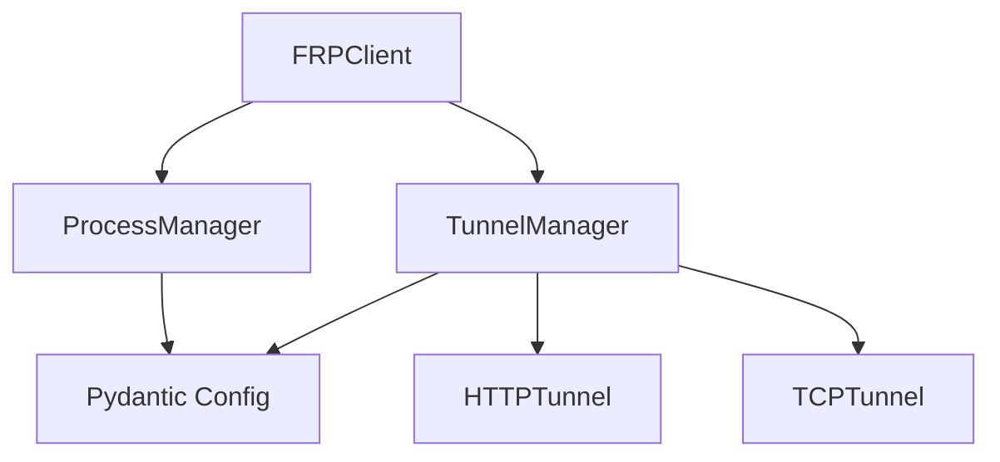

# 간단한 아키텍처 가이드

이 문서는 FRP Python Wrapper의 간단하고 실용적인 아키텍처를 설명합니다. TDD와 Pydantic v2를 활용한 Pythonic 설계를 따릅니다.

## 핵심 모듈 구조



## 핵심 클래스 (Pydantic 기반)

### 1. FRPClient (메인 클라이언트)

FRP 서버에 연결하고 터널을 관리하는 메인 클래스입니다.

```python
from pydantic import BaseModel, Field, ConfigDict
from typing import Optional, List
from enum import Enum

class ConnectionStatus(str, Enum):
    """연결 상태"""
    DISCONNECTED = "disconnected"
    CONNECTING = "connecting"
    CONNECTED = "connected"
    ERROR = "error"

class ClientConfig(BaseModel):
    """클라이언트 설정"""
    model_config = ConfigDict(
        str_strip_whitespace=True,
        validate_assignment=True,
        extra='forbid'
    )

    server_host: str = Field(..., min_length=1, description="FRP 서버 주소")
    server_port: int = Field(default=7000, ge=1, le=65535, description="FRP 서버 포트")
    auth_token: Optional[str] = Field(None, min_length=8, description="인증 토큰")
    binary_path: Optional[str] = Field(None, description="FRP 바이너리 경로")

class FRPClient:
    """FRP 클라이언트 메인 클래스"""

    def __init__(self, server: str, port: int = 7000, auth_token: Optional[str] = None):
        """클라이언트 초기화"""
        self.config = ClientConfig(
            server_host=server,
            server_port=port,
            auth_token=auth_token
        )
        self.status = ConnectionStatus.DISCONNECTED
        self._process_manager = ProcessManager()
        self._tunnels: List[BaseTunnel] = []

    def connect(self) -> bool:
        """서버에 연결"""
        # 구현은 TDD로 진행
        pass

    def disconnect(self) -> bool:
        """서버 연결 해제"""
        # 구현은 TDD로 진행
        pass

    def is_connected(self) -> bool:
        """연결 상태 확인"""
        return self.status == ConnectionStatus.CONNECTED
```

### 2. ProcessManager (프로세스 관리)

FRP 바이너리 프로세스를 관리합니다.

```python
class ProcessStatus(str, Enum):
    """프로세스 상태"""
    STOPPED = "stopped"
    STARTING = "starting"
    RUNNING = "running"
    STOPPING = "stopping"
    ERROR = "error"

class ProcessConfig(BaseModel):
    """프로세스 설정"""
    model_config = ConfigDict(str_strip_whitespace=True)

    binary_path: str = Field(..., description="FRP 바이너리 경로")
    config_file: str = Field(..., description="설정 파일 경로")
    working_dir: Optional[str] = Field(None, description="작업 디렉토리")
    timeout: int = Field(default=30, ge=1, le=300, description="타임아웃 (초)")

class ProcessManager:
    """FRP 프로세스 관리 클래스"""

    def __init__(self, binary_path: Optional[str] = None):
        """프로세스 매니저 초기화"""
        self.binary_path = binary_path or self._find_binary()
        self.status = ProcessStatus.STOPPED
        self.pid: Optional[int] = None

    def start(self, config_file: str) -> bool:
        """프로세스 시작"""
        # 구현은 TDD로 진행
        pass

    def stop(self) -> bool:
        """프로세스 종료"""
        # 구현은 TDD로 진행
        pass

    def is_running(self) -> bool:
        """실행 상태 확인"""
        return self.status == ProcessStatus.RUNNING
```

### 3. Tunnel (터널 클래스)

로컬 서비스를 외부에 노출하는 터널을 관리합니다.

```python
class TunnelStatus(str, Enum):
    """터널 상태"""
    PENDING = "pending"
    CONNECTING = "connecting"
    CONNECTED = "connected"
    DISCONNECTED = "disconnected"
    ERROR = "error"
    CLOSED = "closed"

class BaseTunnel(BaseModel):
    """터널 기본 클래스"""
    model_config = ConfigDict(
        str_strip_whitespace=True,
        validate_assignment=True,
        extra='forbid'
    )

    id: str = Field(..., min_length=1, description="터널 고유 식별자")
    local_port: int = Field(..., ge=1, le=65535, description="로컬 포트")
    status: TunnelStatus = Field(default=TunnelStatus.PENDING)
    created_at: datetime = Field(default_factory=datetime.now)

    def close(self) -> None:
        """터널 종료"""
        # 구현은 TDD로 진행
        pass

class HTTPTunnel(BaseTunnel):
    """HTTP 터널"""

    path: str = Field(..., min_length=1, description="URL 경로")
    custom_domains: List[str] = Field(default_factory=list)
    websocket_support: bool = Field(default=True)

    @property
    def url(self) -> Optional[str]:
        """터널 접속 URL"""
        if self.status == TunnelStatus.CONNECTED and self.custom_domains:
            domain = self.custom_domains[0]
            return f"https://{domain}/{self.path}/"
        return None

class TCPTunnel(BaseTunnel):
    """TCP 터널"""

    remote_port: Optional[int] = Field(None, ge=1, le=65535)

    @property
    def endpoint(self) -> Optional[str]:
        """터널 엔드포인트"""
        if self.status == TunnelStatus.CONNECTED and self.remote_port:
            return f"server:{ self.remote_port}"
        return None
```


### 4. Config (설정 관리)

FRP 설정을 Pydantic으로 관리합니다.

```python
class FRPServerConfig(BaseModel):
    """FRP 서버 설정"""
    model_config = ConfigDict(str_strip_whitespace=True)

    server_addr: str = Field(..., description="서버 주소")
    server_port: int = Field(default=7000, ge=1, le=65535)
    auth_token: Optional[str] = Field(None, min_length=8)

class TunnelConfigEntry(BaseModel):
    """터널 설정 항목"""

    name: str = Field(..., min_length=1, description="터널 이름")
    type: str = Field(..., pattern="^(tcp|http|udp)$")
    local_port: int = Field(..., ge=1, le=65535)
    custom_domains: List[str] = Field(default_factory=list)
    locations: List[str] = Field(default_factory=list)

class ConfigBuilder:
    """FRP 설정 파일 생성 클래스"""

    def __init__(self):
        self.server_config: Optional[FRPServerConfig] = None
        self.tunnels: List[TunnelConfigEntry] = []

    def set_server(self, host: str, port: int = 7000, token: Optional[str] = None):
        """서버 설정"""
        self.server_config = FRPServerConfig(
            server_addr=host,
            server_port=port,
            auth_token=token
        )

    def add_tunnel(self, tunnel: TunnelConfigEntry):
        """터널 추가"""
        self.tunnels.append(tunnel)

    def build_toml(self) -> str:
        """TOML 설정 파일 생성"""
        # 구현은 TDD로 진행
        pass
```

## 사용 예제

### 기본 사용법

```python
from frp_wrapper import FRPClient

# 1. 클라이언트 생성 및 연결
client = FRPClient("example.com", auth_token="your-token")
client.connect()

# 2. HTTP 터널 생성
tunnel = client.expose_path(3000, "myapp")
print(f"URL: {tunnel.url}")  # https://example.com/myapp/

# 3. TCP 터널 생성
tcp_tunnel = client.expose_tcp(5432)
print(f"Endpoint: {tcp_tunnel.endpoint}")

# 4. 정리
tunnel.close()
tcp_tunnel.close()
client.disconnect()
```

### Context Manager 사용

```python
with FRPClient("example.com") as client:
    with client.expose_path(3000, "myapp") as tunnel:
        print(f"Tunnel active: {tunnel.url}")
        # 자동으로 터널과 클라이언트가 정리됨
```


## 설계 원칙

### 1. Pydantic 활용
- 모든 설정과 데이터는 Pydantic BaseModel 사용
- 자동 유효성 검증과 타입 안전성 제공
- JSON/YAML 직렬화/역직렬화 지원

### 2. TDD (Test-Driven Development)
- 모든 기능은 테스트 작성 후 구현
- 95% 이상의 테스트 커버리지 유지
- Property-based testing으로 견고성 확보

### 3. 간단한 API
- 복잡한 함수형 패턴 대신 직관적인 클래스 기반 설계
- 표준 Python 예외 처리
- Context manager로 자동 리소스 관리

## 개발 워크플로

### 1. 테스트 작성
```python
def test_create_http_tunnel():
    """HTTP 터널 생성 테스트"""
    client = FRPClient("example.com")
    tunnel = client.expose_path(3000, "myapp")

    assert tunnel.local_port == 3000
    assert tunnel.path == "myapp"
    assert tunnel.status == TunnelStatus.PENDING
```

### 2. 구현
```python
def expose_path(self, local_port: int, path: str) -> HTTPTunnel:
    """HTTP 터널 생성"""
    tunnel = HTTPTunnel(
        id=generate_tunnel_id(),
        local_port=local_port,
        path=path
    )
    self._tunnels.append(tunnel)
    return tunnel
```

### 3. 리팩터링
- 테스트 통과 후 코드 개선
- Pydantic 모델 최적화
- 성능 및 가독성 향상

## 테스트 가이드

### Pydantic 모델 테스트

```python
import pytest
from pydantic import ValidationError

def test_client_config_validation():
    """클라이언트 설정 유효성 검증"""
    # 유효한 설정
    config = ClientConfig(
        server_host="example.com",
        server_port=7000,
        auth_token="secret123"
    )
    assert config.server_host == "example.com"

    # 잘못된 포트
    with pytest.raises(ValidationError):
        ClientConfig(server_host="example.com", server_port=0)

    # 빈 호스트
    with pytest.raises(ValidationError):
        ClientConfig(server_host="")
```

### 클래스 동작 테스트

```python
def test_tunnel_creation():
    """터널 생성 테스트"""
    tunnel = HTTPTunnel(
        id="test-tunnel",
        local_port=3000,
        path="myapp"
    )

    assert tunnel.id == "test-tunnel"
    assert tunnel.local_port == 3000
    assert tunnel.path == "myapp"
    assert tunnel.status == TunnelStatus.PENDING
```

### Property-based 테스트

```python
from hypothesis import given, strategies as st

@given(port=st.integers(min_value=1, max_value=65535))
def test_valid_ports_always_work(port):
    """유효한 포트는 항상 동작"""
    tunnel = HTTPTunnel(
        id="test",
        local_port=port,
        path="test"
    )
    assert tunnel.local_port == port
```

## 참고 사항

- Pydantic v2의 최신 기능 활용 (Field, ConfigDict 등)
- 모든 외부 의존성은 명확한 인터페이스로 분리
- 설정과 데이터 검증은 Pydantic이 자동 처리
- TDD 사이클을 통한 견고한 코드 구조
