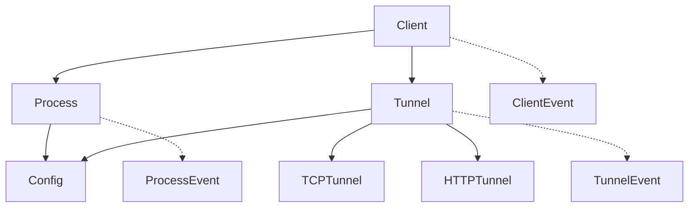

# 도메인 모델 설계

이 문서는 FRP Python Wrapper의 핵심 도메인 모델을 설명합니다. 모든 도메인 모델은 불변(immutable) 데이터 구조로 설계되었습니다.

## 도메인 개요



## 핵심 도메인 모델

### 1. Client (클라이언트)

FRP 서버에 연결하는 클라이언트를 나타냅니다.

```python
@frozen
@dataclass
class ClientId:
    """클라이언트 고유 식별자"""
    value: str

@frozen
@dataclass
class ServerAddress:
    """서버 주소"""
    host: str
    port: int = 7000
    
    def __post_init__(self):
        if not self.host:
            raise ValueError("Server host cannot be empty")
        if not 1 <= self.port <= 65535:
            raise ValueError(f"Invalid port: {self.port}")

@frozen
@dataclass
class AuthToken:
    """인증 토큰"""
    value: str
    
    def masked(self) -> str:
        """토큰을 마스킹하여 반환"""
        if len(self.value) <= 8:
            return "***"
        return f"{self.value[:4]}...{self.value[-4:]}"

@frozen
@dataclass
class ConnectionState:
    """연결 상태"""
    status: str = "disconnected"  # disconnected, connecting, connected, error
    server: Optional[ServerAddress] = None
    connected_at: Optional[datetime] = None
    last_error: Optional[str] = None

@frozen
@dataclass
class Client:
    """FRP 클라이언트"""
    id: ClientId
    server: ServerAddress
    auth_token: Optional[AuthToken] = None
    connection_state: ConnectionState = field(default_factory=ConnectionState)
    process_id: Optional[ProcessId] = None
    config_path: Optional[str] = None
```

### 2. Process (프로세스)

FRP 바이너리 프로세스를 나타냅니다.

```python
@frozen
@dataclass
class ProcessId:
    """프로세스 고유 식별자"""
    value: str

@frozen
@dataclass
class BinaryPath:
    """바이너리 경로"""
    value: str
    
    def __post_init__(self):
        # 경로 유효성은 Effect에서 검증
        if not self.value:
            raise ValueError("Binary path cannot be empty")

@frozen
@dataclass
class Process:
    """FRP 프로세스"""
    id: ProcessId
    binary_path: BinaryPath
    config_path: str
    status: str = "stopped"  # stopped, starting, running, stopping
    pid: Optional[int] = None
    started_at: Optional[datetime] = None
    
    def with_status(self, status: str, **kwargs) -> 'Process':
        """새로운 상태를 가진 프로세스 인스턴스 반환"""
        return dataclasses.replace(self, status=status, **kwargs)
```

### 3. Tunnel (터널)

로컬 서비스를 외부에 노출하는 터널을 나타냅니다.

```python
@frozen
@dataclass
class TunnelId:
    """터널 고유 식별자"""
    value: str

@frozen
@dataclass
class Port:
    """포트 번호"""
    value: int
    
    def __post_init__(self):
        if not 1 <= self.value <= 65535:
            raise ValueError(f"Invalid port: {self.value}")

@frozen
@dataclass
class Path:
    """URL 경로"""
    value: str
    
    def __post_init__(self):
        if self.value.startswith('/'):
            raise ValueError("Path must not start with /")

@frozen
@dataclass
class TunnelConfig:
    """터널 설정"""
    local_port: Port
    tunnel_type: str  # 'tcp', 'http', 'udp'
    remote_port: Optional[Port] = None
    custom_domains: List[str] = field(default_factory=list)
    options: Dict[str, Any] = field(default_factory=dict)

@frozen
@dataclass
class Tunnel:
    """터널 기본 타입"""
    id: TunnelId
    config: TunnelConfig
    client_id: ClientId
    status: str = "pending"  # pending, connecting, connected, disconnected, error, closed
    created_at: datetime = field(default_factory=datetime.now)
    connected_at: Optional[datetime] = None
    error_message: Optional[str] = None
```

#### TCP 터널

```python
@frozen
@dataclass
class TCPTunnel(Tunnel):
    """TCP 터널"""
    
    @property
    def endpoint(self) -> Optional[str]:
        """터널 엔드포인트 (host:port)"""
        if self.config.remote_port and self.status == "connected":
            # server_host는 context에서 제공
            return f"{server_host}:{self.config.remote_port.value}"
        return None
```

#### HTTP 터널

```python
@frozen
@dataclass
class HTTPTunnel(Tunnel):
    """HTTP 터널"""
    path: Optional[Path] = None
    custom_domains: List[str] = field(default_factory=list)
    locations: List[str] = field(default_factory=list)
    strip_path: bool = True
    websocket: bool = True
    
    @property
    def url(self) -> Optional[str]:
        """터널 접속 URL"""
        if self.status == "connected" and self.custom_domains and self.locations:
            domain = self.custom_domains[0]
            location = self.locations[0]
            return f"https://{domain}{location}/"
        return None
```

### 4. Config (설정)

FRP 설정을 나타냅니다.

```python
@frozen
@dataclass
class ServerConfig:
    """서버 설정"""
    address: str
    port: int = 7000
    auth_token: Optional[str] = None

@frozen
@dataclass
class TunnelConfigEntry:
    """설정 파일의 터널 항목"""
    name: str
    tunnel_type: str
    local_port: int
    custom_domains: List[str] = field(default_factory=list)
    locations: List[str] = field(default_factory=list)
    remote_config: Dict[str, Any] = field(default_factory=dict)

@frozen
@dataclass
class FRPConfig:
    """FRP 전체 설정"""
    server: ServerConfig
    tunnels: List[TunnelConfigEntry] = field(default_factory=list)
    
    def add_tunnel(self, tunnel: TunnelConfigEntry) -> 'FRPConfig':
        """새 터널이 추가된 설정 반환"""
        return dataclasses.replace(
            self,
            tunnels=self.tunnels + [tunnel]
        )
    
    def remove_tunnel(self, name: str) -> 'FRPConfig':
        """터널이 제거된 설정 반환"""
        return dataclasses.replace(
            self,
            tunnels=[t for t in self.tunnels if t.name != name]
        )
```

## 도메인 이벤트

모든 상태 변경은 이벤트로 추적됩니다.

### 기본 이벤트

```python
@dataclass
class DomainEvent:
    """도메인 이벤트 기본 클래스"""
    event_id: str = field(default_factory=lambda: str(uuid.uuid4()))
    occurred_at: datetime = field(default_factory=datetime.now)
```

### 클라이언트 이벤트

```python
@dataclass
class ClientCreated(DomainEvent):
    """클라이언트 생성 이벤트"""
    client_id: ClientId
    server: ServerAddress

@dataclass
class ClientConnected(DomainEvent):
    """클라이언트 연결 이벤트"""
    client_id: ClientId
    server: ServerAddress

@dataclass
class ClientDisconnected(DomainEvent):
    """클라이언트 연결 해제 이벤트"""
    client_id: ClientId
    reason: Optional[str] = None
```

### 프로세스 이벤트

```python
@dataclass
class ProcessStarted(DomainEvent):
    """프로세스 시작 이벤트"""
    process_id: ProcessId
    pid: int

@dataclass
class ProcessStopped(DomainEvent):
    """프로세스 종료 이벤트"""
    process_id: ProcessId
    exit_code: Optional[int] = None
```

### 터널 이벤트

```python
@dataclass
class TunnelCreated(DomainEvent):
    """터널 생성 이벤트"""
    tunnel_id: TunnelId
    tunnel_type: str
    local_port: int
    path: Optional[str] = None

@dataclass
class TunnelConnected(DomainEvent):
    """터널 연결 이벤트"""
    tunnel_id: TunnelId

@dataclass
class TunnelDisconnected(DomainEvent):
    """터널 연결 해제 이벤트"""
    tunnel_id: TunnelId
    reason: Optional[str] = None

@dataclass
class TunnelClosed(DomainEvent):
    """터널 종료 이벤트"""
    tunnel_id: TunnelId
    reason: Optional[str] = None
```

## 값 객체 (Value Objects)

### Result 타입

```python
T = TypeVar('T')
E = TypeVar('E')

@dataclass
class Ok(Generic[T]):
    """성공 결과"""
    value: T

@dataclass
class Err(Generic[E]):
    """실패 결과"""
    error: E

Result = Union[Ok[T], Err[E]]
```

### Option 타입

```python
@dataclass
class Some(Generic[T]):
    """값이 있음"""
    value: T

@dataclass
class Nothing:
    """값이 없음"""
    pass

Option = Union[Some[T], Nothing]
```

## 도메인 규칙

### 1. 불변성 규칙
- 모든 도메인 객체는 `@frozen` 데코레이터 사용
- 상태 변경은 새 객체 생성으로만 가능
- 리스트나 딕셔너리는 `field(default_factory=...)` 사용

### 2. 유효성 검증
- 값 객체는 생성 시점에 유효성 검증
- 비즈니스 규칙은 도메인 서비스에서 검증
- I/O 관련 검증은 Effect에서 처리

### 3. 이벤트 소싱
- 모든 상태 변경은 이벤트 발생
- 이벤트는 불변이며 추가만 가능
- 이벤트로부터 상태 재구성 가능

## 예제: 터널 생명주기

```python
# 1. 터널 생성
tunnel = TCPTunnel(
    id=TunnelId("tunnel-123"),
    config=TunnelConfig(
        local_port=Port(3000),
        tunnel_type="tcp",
        remote_port=Port(8080)
    ),
    client_id=ClientId("client-456")
)
# 이벤트: TunnelCreated

# 2. 터널 연결
connected_tunnel = tunnel.with_status(
    "connected",
    connected_at=datetime.now()
)
# 이벤트: TunnelConnected

# 3. 터널 종료
closed_tunnel = connected_tunnel.with_status(
    "closed",
    error_message="User requested"
)
# 이벤트: TunnelClosed
```

## 테스트 가이드

### 도메인 모델 생성 테스트

```python
def test_create_tunnel():
    tunnel = TCPTunnel(
        id=TunnelId("test-id"),
        config=TunnelConfig(
            local_port=Port(3000),
            tunnel_type="tcp"
        ),
        client_id=ClientId("client-id")
    )
    
    assert tunnel.id.value == "test-id"
    assert tunnel.config.local_port.value == 3000
    assert tunnel.status == "pending"
```

### 불변성 테스트

```python
def test_tunnel_immutability():
    tunnel = create_test_tunnel()
    
    # 직접 수정 불가
    with pytest.raises(dataclasses.FrozenInstanceError):
        tunnel.status = "connected"
    
    # 새 객체 생성으로만 변경 가능
    new_tunnel = tunnel.with_status("connected")
    assert tunnel.status == "pending"  # 원본 불변
    assert new_tunnel.status == "connected"  # 새 객체
```

### 유효성 검증 테스트

```python
def test_port_validation():
    # 유효한 포트
    port = Port(8080)
    assert port.value == 8080
    
    # 잘못된 포트
    with pytest.raises(ValueError):
        Port(0)
    
    with pytest.raises(ValueError):
        Port(65536)
```

## 참고 사항

- 도메인 모델은 프레임워크나 인프라에 의존하지 않음
- 비즈니스 로직은 도메인 모델과 순수 함수에만 존재
- 영속성이나 직렬화는 인프라 계층에서 처리