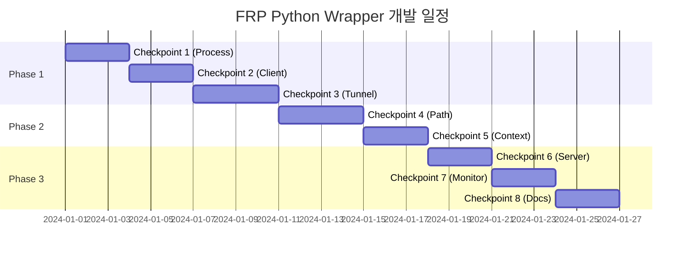

# FRP Python Wrapper 마일스톤

## 프로젝트 타임라인

### 전체 일정: 5주

## Phase 1: 기초 구현 (10일)

### Milestone 1: 프로세스 관리 기반
**기간**: 3일

**목표**
- FRP 프로세스 안정적 관리
- 설정 파일 동적 생성

**산출물**
- `ProcessManager` 클래스
- `ConfigBuilder` 클래스
- 기본 테스트 케이스

**완료 기준**
- [ ] FRP 프로세스 시작/종료 성공
- [ ] 설정 파일 생성 및 검증
- [ ] 100% 유닛 테스트 커버리지

### Milestone 2: 클라이언트 API
**기간**: 3일

**목표**
- 사용자 친화적 API 제공
- 서버 연결 관리

**산출물**
- `FRPClient` 클래스
- 기본 예외 처리
- API 문서 초안

**완료 기준**
- [ ] 클라이언트 초기화 성공
- [ ] 서버 연결 검증
- [ ] 에러 처리 완료

### Milestone 3: 터널 관리
**기간**: 4일

**목표**
- 터널 생명주기 관리
- 기본 TCP 터널 지원

**산출물**
- `Tunnel` 클래스
- TCP 터널 생성 기능
- 터널 상태 추적

**완료 기준**
- [ ] TCP 터널 생성/종료
- [ ] 터널 정보 조회
- [ ] 통합 테스트 통과

## Phase 2: 핵심 기능 (7일)

### Milestone 4: 서브패스 라우팅
**기간**: 4일

**목표**
- HTTP 서브패스 터널링
- URL 라우팅 구현

**산출물**
- `expose_path()` 메서드
- 가상 호스트 매핑
- Nginx 연동 가이드

**완료 기준**
- [ ] 서브패스 터널 동작
- [ ] URL 생성 정확성
- [ ] 경로 변환 테스트

### Milestone 5: Context Manager
**기간**: 3일

**목표**
- 자동 리소스 관리
- Pythonic API 제공

**산출물**
- Context Manager 구현
- 중첩 사용 지원
- 예외 시 정리 로직

**완료 기준**
- [ ] with 문 정상 동작
- [ ] 리소스 누수 없음
- [ ] 예외 처리 검증

## Phase 3: 프로덕션 준비 (8일)

### Milestone 6: 서버 설정 도구
**기간**: 3일

**목표**
- 서버 측 설정 자동화
- 배포 간소화

**산출물**
- Nginx 설정 생성기
- FRP 서버 설정 템플릿
- 설치 스크립트

**완료 기준**
- [ ] 설정 파일 생성
- [ ] 스크립트 실행 성공
- [ ] 문서화 완료

### Milestone 7: 모니터링
**기간**: 3일

**목표**
- 운영 가시성 확보
- 디버깅 지원

**산출물**
- 구조화된 로깅
- 터널 상태 API
- 메트릭 수집

**완료 기준**
- [ ] 로그 레벨 동작
- [ ] 상태 조회 API
- [ ] 이벤트 시스템

### Milestone 8: 최종 완성
**기간**: 3일

**목표**
- 프로젝트 완성도 향상
- 사용자 경험 개선

**산출물**
- 완성된 예제 코드
- 전체 문서
- PyPI 패키지

**완료 기준**
- [ ] 모든 예제 실행 가능
- [ ] 문서 검토 완료
- [ ] 패키지 설치 테스트

## 위험 요소 및 대응 방안

### 기술적 위험

1. **FRP 버전 호환성**
   - 위험: FRP 업데이트로 인한 호환성 문제
   - 대응: 버전별 테스트, 호환성 매트릭스 유지

2. **서브패스 라우팅 복잡도**
   - 위험: Nginx 설정 복잡도 증가
   - 대응: 설정 템플릿화, 자동 생성 도구

3. **프로세스 안정성**
   - 위험: FRP 프로세스 예기치 않은 종료
   - 대응: 자동 재시작, 상태 모니터링

### 일정 위험

1. **통합 테스트 지연**
   - 위험: 실제 환경 테스트 복잡도
   - 대응: Docker 기반 테스트 환경

2. **문서화 부족**
   - 위험: 개발에 집중하여 문서화 소홀
   - 대응: 각 PR마다 문서 업데이트 필수

## 성공 지표

### 정량적 지표
- 95% 이상 테스트 커버리지
- 모든 체크포인트 기한 내 완료
- 0개의 Critical 버그

### 정성적 지표
- 직관적인 API 설계
- 명확한 에러 메시지
- 풍부한 예제 코드

## 체크포인트별 검토 사항

각 체크포인트 완료 시 다음 사항 검토:

1. **코드 품질**
   - [ ] PEP 8 준수
   - [ ] Type hints 사용
   - [ ] Docstring 작성

2. **테스트**
   - [ ] 유닛 테스트 작성
   - [ ] 통합 테스트 통과
   - [ ] 엣지 케이스 처리

3. **문서**
   - [ ] API 문서 업데이트
   - [ ] 예제 코드 추가
   - [ ] CHANGELOG 업데이트

4. **리뷰**
   - [ ] 코드 리뷰 완료
   - [ ] 피드백 반영
   - [ ] PR 승인